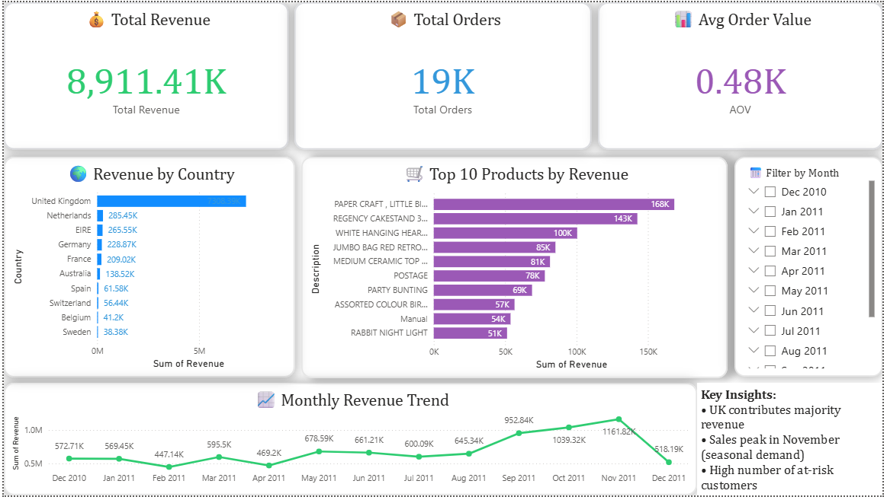

# 🛒 E-commerce Customer Behavior Analytics

## 📌 Overview
This project analyzes e-commerce transactional data to understand customer purchasing behavior, identify high-value customers, and generate business insights.

---

## 🎯 Objectives
- Analyze customer purchase behavior  
- Identify top-selling products  
- Perform customer segmentation using RFM  
- Detect high-value and at-risk customers  
- Analyze seasonal sales trends  

---

## 🛠️ Tools & Technologies
- Python (Pandas, NumPy)
- Data Visualization (Matplotlib, Seaborn)
- Power BI (Dashboard)
- Jupyter Notebook

---

## 📂 Dataset
- Online Retail Dataset (UCI Repository)
- Contains transaction-level data:
  - InvoiceNo, Product, Quantity, Price
  - CustomerID, Country, Date

---

## 🔧 Project Workflow

### 1. Data Cleaning
- Removed missing CustomerID values  
- Filtered out negative quantities (returns)  
- Removed invalid prices  
- Created Revenue column  

### 2. Exploratory Data Analysis (EDA)
- Revenue by country  
- Monthly sales trends  
- Top-selling products  

### 3. Customer Segmentation (RFM Analysis)
- Recency: Days since last purchase  
- Frequency: Number of transactions  
- Monetary: Total spending  

Customers were segmented into:
- VIP  
- Loyal  
- Regular  
- At Risk  

---

## 📊 Dashboard (Power BI)
The dashboard includes:
- KPI Cards (Revenue, Orders, AOV)
- Revenue by Country
- Monthly Revenue Trend
- Top Products
- Interactive Filters

---

## 💡 Key Insights
- United Kingdom generates the highest revenue  
- Sales peak during November (seasonal demand)  
- A large portion of customers are at risk of churn  
- VIP customers contribute significantly to total revenue  

---

## 🚀 Business Impact
- Helps identify high-value customers  
- Supports targeted marketing strategies  
- Improves customer retention planning  
- Enables data-driven decision making  

---

## 📸 Dashboard Preview


---

## 🔗 Project Structure
```
ecommerce-customer-analytics/
│
├── dataset/
│   └── online_retail.csv
├── notebooks/
│   └── analysis.ipynb
├── dashboard/
│   ├── dashboard.pbix
│   └── screenshot.png
├── scripts/
│   ├── data_cleaning.py
│   ├── rfm_analysis.py
│   └── main.py
└── README.md

---

## 🙌 Conclusion
This project demonstrates end-to-end data analytics workflow from data cleaning to business insights and dashboard creation.